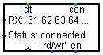

# Logisim UART

General purpose asynchronous buffered receiver/transmitter.
Transfers data between Logisim and host system through a socket.

## Applications
+ [Remote terminal using telnet ](#as-a-telnet-terminal)
+ [Networking](#as-a-plain-socket)

## Installing

+ Download jar file
+ In Logisim, `Project > Load Library > JAR Library`
+ Then you get new library `Network I/O` with `UART` component

## Properties
+ `Port` - listen port

## Pins
+ `clk` - clock signal, _input_
+ `rd/wr'` - read/write, selects operation mode, _input_
+ `en` - enable, when low disables read/write operation, _input_
+ `dt` - data available, high if there is some data in RX buffer, _output_
+ `con` - connection, high if there is active connection, _output_
+ `RX`/`TX` - data pins, _output/input_

## Operations
| en | clk | rd/wr' | Operation | 
|----|:---:|:------:|:---------:|
| 0  |  ↓  |   x    |   No-op   |
| x  |  ↑  |   x    |   Fetch   |
| 1  |  ↓  |   1    |   Read    |
| 1  |  ↓  |   0    |   Write   |
+ ↑ - rising edge
+ ↓ - falling edge
+ x - either 1 or 0

### No-op
When `en` is low, falling edge of `clk` has no effect

### Fetch
On rising edge of `clk`, contents of RX buffer are fetched from network connection and `con` pin status is updated.
`RX` pin outputs a value of the first byte of buffer.

### Read
When `en` is high, `rd/wr'` is high, falling edge of `clk` drops the first byte of buffer and shifts all other bytes.
Updates `RX` pin.

### Write
When `en` is high, `rd/wr'` is low, falling edge of `clk` reads current value of `TX` and sends it.

## Connection
Each instance of terminal opens a new socket on a port specified by `Port` property.
If two instances have the same port, the behaviour is undefined.

### As a Telnet terminal
To use this library as Telnet terminal you need some Telnet client.

For example, you can use:
+ _Windwos:_ [PuTTY](https://www.putty.org/) or [Microsoft telnet](https://www.prajwal.org/how-to-enable-telnet-windows-10/)
+ _Linux:_ `telnet` command
+ _MacOS:_ `telnet` from `brew` package manager

In order connect to an instance of `UART`, set IP to `127.0.0.1` and port to one that you specified in properties of Logisim component.

_Example:_ `telnet 127.0.0.1 7241`

_Note that you need to handle Telnet control messages yourself._

### As a plain socket
This library doesn't really enforce any protocol, so you can connect to instance just like to regular socket and transfer binary data.

### Connecting multiple instances together
Socket opened by `UART` instance acts as a **server**, so it can't directly connect to other sockets.
If you want to transfer data between instances, you need some program on your host system that will connect to those instances and do all necessary routing.

## Errors and troubleshooting

### `Port is in use` status message
If you get this message as status, that means that specified `Port` is occupied, so it can't be bound.
To resolve this, you can either **choose another port** or free up current port, for example by finding and closing program that uses it.

### Other errors
If you get undefined behaviour, hanged up sockets or `error` in status, you can try to **restart Logisim**, it will close unused sockets and try to reopen used ones.
_On some systems you might need to wait up to minute for hanged up sockets to close. That is sometimes the case for `port in use` status._
